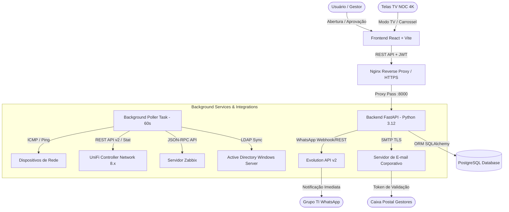

<div align="center">

# 🏨 TIHFSA — IT Operations, Helpdesk, CMDB & NOC Platform

### Hotel Fasano Salvador | Gestão Integrada de Tecnologia da Informação

[](https://fastapi.tiangolo.com/)
[](https://python.org)
[](https://reactjs.org/)
[](https://vitejs.dev/)
[](https://tailwindcss.com/)
[](https://www.postgresql.org/)
[](https://ui.com)
[](https://www.zabbix.com/)
[](https://evolution-api.com)

<p align="center">
  Plataforma unificada desenvolvida sob medida para a governança e operação de TI do Hotel Fasano Salvador, centralizando Helpdesk com fluxo de aprovação por gestores, inventário completo de hardware (CMDB), monitoramento inteligente de rede em tempo real (NOC) e automações proativas de infraestrutura.
</p>

---

</div>

## 📌 Sumário

- [Visão Geral e Objetivos](#-visão-geral-e-objetivos)
- [Principais Funcionalidades](#-principais-funcionalidades)
  - [1. Helpdesk & Governança de Chamados](#1-helpdesk--governança-de-chamados)
  - [2. CMDB & Inventário de Ativos](#2-cmdb--inventário-de-ativos)
  - [3. Painel NOC & Topologia de Rede (TV 4K Ready)](#3-painel-noc--topologia-de-rede-tv-4k-ready)
  - [4. Monitoramento Proativo & Automação Inteligente](#4-monitoramento-proativo--automação-inteligente)
  - [5. Notificações Multicanal (WhatsApp & E-mail Dual)](#5-notificações-multicanal-whatsapp--e-mail-dual)
- [Arquitetura do Sistema](#-arquitetura-do-sistema)
- [Tecnologias Utilizadas](#-tecnologias-utilizadas)
- [Como Executar Localmente](#-como-executar-localmente)
- [Estrutura de Diretórios](#-estrutura-de-diretórios)
- [Deploy & Operação em Produção](#-deploy--operação-em-produção)
- [Controle de Acesso & Permissões](#-controle-de-acesso--permissões)
- [Licença & Créditos](#-licença--créditos)

---

## 🎯 Visão Geral e Objetivos

O **TIHFSA** foi concebido para transformar a operação diária de TI da hotelaria de luxo, eliminando completamente o *"Shadow IT"* e os atendimentos informais via balcão ou mensagens privadas de WhatsApp.

### Pilares Fundamentais:
1. **Centralização & Rastreabilidade**: 100% das demandas registradas, categorizadas e vinculadas a ativos e solicitantes com SLA monitorado.
2. **Governança de Fechamento**: O técnico não encerra o chamado unilateralmente; o Gestor do solicitante (ou o próprio usuário) valida e homologa o encerramento do serviço.
3. **Visibilidade Tática (NOC 24/7)**: Telas de alta performance para painéis de parede e televisores, com atualização em tempo real, rotação de carrossel e alertas sonoros imediatos.
4. **Proatividade Extrema**: Detecção de anomalias na infraestrutura (quedas de APs/Switches, loops de rede STP, conflitos de IP) com abertura instantânea de chamados antes mesmo de qualquer impacto aos hóspedes ou colaboradores.

---

## 🚀 Principais Funcionalidades

### 1. Helpdesk & Governança de Chamados
- **Ciclo de Vida Controlado**:
  $$\text{Novo (NEW)} \longrightarrow \text{Em Andamento (IN\_PROGRESS)} \longrightarrow \text{Aguardando Validação (PENDING\_VALIDATION)} \longrightarrow \text{Fechado (CLOSED) / Rejeitado (REJECTED)}$$
- **Aprovação do Gestor**: Ao concluir a manutenção, o chamado vai para `Aguardando Validação`. O sistema envia um e-mail com **Token JWT de Uso Único** e botão direto para o Gestor do setor homologar com 1 clique (sem necessidade de login complexo).
- **Hierarquia do Active Directory (AD/LDAP)**: Importação e sincronização automática da árvore organizacional (`Colaborador` $\rightarrow$ `Gestor Responsável` $\rightarrow$ `Setor`), garantindo roteamento de aprovação sem falhas humanas.
- **Entidades de Apartamentos / UH**: Além de colaboradores do backoffice, os apartamentos do hotel são cadastrados como unidades solicitantes e vinculadas aos equipamentos instalados em cada quarto (Smart TVs, decodificadores SKY, antenas UniFi AP).

### 2. CMDB & Inventário de Ativos
- **Rastreabilidade Completa**: Cadastro de Switches, Racks, Servidores, Access Points, Impressoras, Desktops, Telefonia IP e TV/Áudio.
- **Vínculos Dinâmicos**: Associação direta entre Ativo $\leftrightarrow$ Localização Física (Rack, Andar, Setor, UH) $\leftrightarrow$ Histórico de Chamados.
- **Sincronização com Ferramentas de Rede**: Coleta e associação automática de endereços MAC, endereços IP, números de série e modelos com a controladora UniFi e o Zabbix.

### 3. Painel NOC & Topologia de Rede (TV 4K Ready)
- **Editor e Visualizador de Topologia Interativo**:
  - Canvas SVG fluido com suporte a arraste suave (pan), zoom, e conexões cabeadas inteligentes entre portas.
  - **Dimensionamento Granular**: Ajuste livre de largura e altura dos cards (ou presets: Padrão 220px, Médio 260px, Largo 300px, Extra Largo 340px) com alça de redimensionamento direto no canvas.
  - **Segregação Rigorosa de Métricas Contextuais**:
    - **Switches**: CPU, RAM, Uptime, Firmware, contagem de portas ativas/livres (`● X up` / `○ Y down`), portas PoE ativas (`⚡ Z PoE`), taxas RX/TX e LAN Experience.
    - **Access Points (APs)**: CPU, RAM, Uptime, Firmware, WiFi Experience (%), contagem de clientes conectados, ocupação de canais (2.4GHz / 5GHz / 6GHz) e taxas de transmissão.
    - **Racks**: Agrupamento visual inteligente exibindo os ativos internos em conformidade com o tipo.
- **Alerta Sonoro Inteligente (Web Audio API)**:
  - Tom harmônico suave (D5/A5) intercalado a cada 2 segundos enquanto houver nós offline no mapa.
  - Botão de ativação em 1 clique (🔔) no cabeçalho do card ou via modal, com barra flutuante de controle geral (Silenciar/Testar).
- **Modo TV Pública (`/noc`) & Carrossel Contínuo**:
  - Acesso direto sem login para televisores de monitoramento NOC.
  - **Carrossel Automático**: Playlist de rotação entre múltiplos fluxogramas (ex: 1º Andar $\rightarrow$ 2º Andar $\rightarrow$ Core TI) com tempos independentes (mínimo 5s), ordenação natural A $\rightarrow$ Z e reordenação por setas.
  - **Cadeado de Segurança**: Bloqueio automático de edição após 15 minutos de inatividade real.
  - **Memória de Tela (Cookies/LocalStorage)**: Cada monitor/TV salva seu zoom, posicionamento e escala individualmente.

### 4. Monitoramento Proativo & Automação Inteligente
- **Worker em Segundo Plano (`unifi_poller_task`)**: Executado continuamente a cada 60 segundos com processamento assíncrono não-bloqueante (`asyncio.to_thread`).
- **Detecção de Dispositivos Offline**:
  - Se um Switch ou AP perde a comunicação (`state == 0`), abre chamado automático de prioridade Alta/Crítica e notifica a equipe.
  - Ao restabelecer a conexão (`state == 1`), atualiza o chamado para `Aguardando Validação` e dispara notificação de resolução.
- **Monitoramento Ativo de Conflitos de IP na Rede**:
  - Monitora em tempo real a tabela de clientes ativos (`/stat/sta`).
  - Identifica quando múltiplos dispositivos distintos (MACs diferentes) estão conectados **simultaneamente** com o mesmo IP, mapeando **nomes dos dispositivos, MACs, rede/VLAN, switch físico e porta de conexão** de cada máquina envolvida (evitando falsos positivos de rotação de DHCP em clientes desconectados).
- **Monitoramento de Alertas Críticos UniFi**:
  - Captura eventos não resolvidos da controladora (`/v2/api/site/{site}/next-ai/logs` e `/stat/alarm?archived=false`).
  - Cobre: servidores DHCP fraudulentos (*Rogue DHCP*), loops de rede Spanning Tree (`EVT_SW_StpPortBlocking`), sobrecarga de PoE, falhas de energia em switch/RPS, failover LTE e quedas de túneis VPN.
- **Idempotência Rigorosa**:
  - Impede a abertura repetida de chamados a cada minuto para o mesmo incidente no mesmo dia.
  - Reabertura automática caso o evento reincida após resolução.

### 5. Notificações Multicanal (WhatsApp & E-mail Dual)
- **WhatsApp via Evolution API v2**:
  - Alertas automáticos imediatos no grupo de operações de TI com formatação em destaque, identificação do equipamento e link do chamado.
- **E-mail Corporativo (SMTP)**:
  - Envio de notificações de abertura, reabertura e encerramento com tabelas HTML estilizadas.
  - Disparo de links seguros para validação de gestores.
- **Resumo Periódico Agendado**: Envio programado no grupo de suporte com o resumo dos chamados pendentes e cobrança automática de prazos de atendimento.

---

## 🏗️ Arquitetura do Sistema



---

## 🛠️ Tecnologias Utilizadas

### Backend
- **Linguagem**: Python 3.12+
- **Framework Web**: [FastAPI](https://fastapi.tiangolo.com/) (ASGI de altíssima performance)
- **Servidor ASGI**: Uvicorn
- **ORM & Banco de Dados**: SQLAlchemy 2.0 com PostgreSQL (suporte SQLite em dev)
- **Validação de Schemas**: Pydantic v2
- **Cliente HTTP Assíncrono**: HTTPX (com suporte a certificados auto-assinados de controladoras)
- **Criptografia & Autenticação**: Passlib (Bcrypt), Python-JOSE (JWT Tokens)
- **Integração LDAP**: ldap3

### Frontend
- **Framework**: React 18
- **Bundler & Dev Server**: Vite
- **Estilização**: Tailwind CSS v3
- **Ícones**: Lucide React
- **Gráficos & Diagramas**: Canvas interativo SVG nativo, micro-animações CSS e Web Audio API
- **Cliente HTTP**: Axios com interceptors de autenticação

---

## 💻 Como Executar Localmente

### Pré-requisitos
- **Node.js**: v18.0.0 ou superior
- **Python**: v3.12 ou superior
- **PostgreSQL** ou **SQLite** (padrão em ambiente de desenvolvimento)

---

### 1. Configurando o Backend

1. Abra o terminal **PowerShell** no Windows e navegue até a pasta do backend:
   ```powershell
   cd backend
   ```

2. Crie e ative o ambiente virtual:
   ```powershell
   py -m venv venv
   .\venv\Scripts\Activate.ps1
   ```

3. Instale as dependências:
   ```powershell
   pip install -r requirements.txt
   ```

4. Configure o arquivo de variáveis de ambiente:
   Crie um arquivo `.env` na raiz da pasta `backend/` contendo:
   ```ini
   DATABASE_URL=sqlite:///./tihfsa.db
   SECRET_KEY=sua_chave_secreta_jwt_super_segura
   ALGORITHM=HS256
   ACCESS_TOKEN_EXPIRE_MINUTES=480
   SMTP_HOST=smtp.office365.com
   SMTP_PORT=587
   SMTP_USER=ti-hfsa@fasano.com.br
   SMTP_PASS=sua_senha_smtp
   ```

5. Inicie o servidor da API:
   ```powershell
   uvicorn app.main:app --reload --host 0.0.0.0 --port 8000
   ```
   Acesse a documentação Swagger interativa em: `http://localhost:8000/docs`

---

### 2. Configurando o Frontend

1. Em uma nova aba do terminal, navegue até a pasta do frontend:
   ```powershell
   cd frontend
   ```

2. Instale os pacotes:
   ```powershell
   npm install
   ```

3. Configure o arquivo de ambiente:
   Crie o arquivo `.env` na pasta `frontend/`:
   ```ini
   VITE_API_BASE_URL=http://localhost:8000/api/v1
   ```

4. Inicie o servidor de desenvolvimento:
   ```powershell
   npm run dev
   ```
   A interface estará acessível em: `http://localhost:5173`

---

## 📁 Estrutura de Diretórios

```
TIHFSA/
├── backend/
│   ├── app/
│   │   ├── models/                # Modelos SQLAlchemy (Ticket, Asset, User, Configs)
│   │   ├── routers/               # Rotas da API (tickets, assets, network_maps, integrations)
│   │   ├── schemas/               # Schemas de validação Pydantic
│   │   ├── services/              # Serviços de negócio (unifi_service, zabbix, evolution, email)
│   │   ├── database.py            # Conexão com o banco de dados
│   │   └── main.py                # Ponto de entrada FastAPI e inicialização de background tasks
│   ├── requirements.txt           # Dependências Python
│   └── venv/                      # Ambiente virtual Python
│
├── frontend/
│   ├── src/
│   │   ├── components/            # Componentes reutilizáveis (Admin, Helpdesk, NOC, Topologia)
│   │   │   └── admin/             # TopologyMapBuilder, PublicNocPanel, etc.
│   │   ├── contexts/              # Contextos React (AuthContext, etc.)
│   │   ├── services/              # Chamadas à API backend (api.js, integrations.js)
│   │   ├── App.jsx                # Roteamento e layouts
│   │   └── main.jsx               # Ponto de entrada React
│   ├── package.json               # Dependências do frontend
│   └── vite.config.js             # Configurações do Vite
│
├── DOC.md                         # Documentação técnica aprofundada de arquitetura
├── README.md                      # Documento principal de apresentação do projeto
├── start.sh                       # Script de inicialização para servidores Linux
└── github.bat                     # Script de automação Git para Windows PowerShell
```

---

## 🚀 Deploy & Operação em Produção

Para implantação em servidores **Ubuntu / Debian** corporativos:

1. **Nginx como Reverse Proxy**:
   - Redirecionamento forçado da porta 80 (HTTP) para 443 (HTTPS).
   - Terminação SSL com certificados válidos e suporte a WebSockets (`Upgrade $http_upgrade`).
   - Servindo a build de produção do frontend (`dist/`) e encaminhando `/api` para a porta local `8000`.

2. **Systemd Services**:
   - Gerenciamento dos serviços backend com reinicialização automática (`Restart=always`).
   - Monitoramento de logs via `journalctl -u tihfsa-backend -f`.

3. **Automação de Inicialização**:
   - Execute o script `start.sh` para verificar permissões, compilar o frontend e subir a API.

---

## 🔐 Controle de Acesso & Permissões

| Papel | Descrição | Permissões Principais |
|---|---|---|
| **ADMIN** | Gestores e Administradores de TI | Acesso completo a configurações, CMDB, integrações, NOC e gestão total de chamados. |
| **TECH** | Analistas e Técnicos de Suporte | Atendimento e resolução de chamados, movimentação de ativos e visualização de topologia. |
| **MANAGER** | Gestores dos Setores do Hotel | Aprovação e homologação de chamados de colaboradores do seu setor via portal ou token seguro. |
| **USER** | Colaboradores / Recepção / UH | Abertura de chamados, acompanhamento de status e consulta aos seus tickets. |

---

## 📄 Licença & Créditos

Este software foi desenvolvido para uso exclusivo e personalizado na infraestrutura do **Hotel Fasano Salvador**.

**Desenvolvido por**: Equipe de Tecnologia da Informação — Hotel Fasano Salvador  
**Contato**: `ti-hfsa@fasano.com.br`
